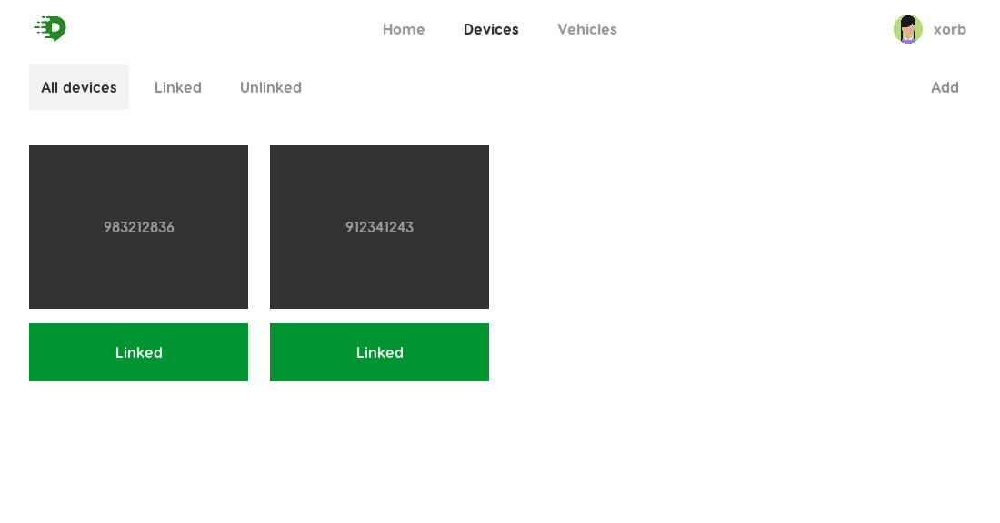

# relocate

Servicio de rastreo en tiempo real.

## Description

El presente proyecto la interfaz de usuario para gestionar la posicipon en tiempo real de determinados dispositivos. EL sistema aun esta en desarrollo y es con propositos demostrativos.

## Diseño de la aplicación

Para la primera fase de la aplicación se ha diseñado una arquitectura muy sencilla. A continuación se presentan los requisitos que se tendrá que satisfacer:

1. Multiples dispositivos envían su posición a un servidor
2. El servidor almacena los datos una base de datos y a la vez emite esta posición a un cliente.
3. El cliente muestra los datos en una interfaz de usuario


## Tecnologias usadas

Para satisfacer los requisitos anteriores, se ha elegido las siguientes tecnologías.

- <b>Typescript: </b>TypeScript agrega tipos opcionales a JavaScript que admiten herramientas para aplicaciones de JavaScript a gran escala para cualquier navegador, para cualquier host, en cualquier sistema operativo.

- <b>ReactJS: </b> Libraria javascript para crear interfaces de usuario basada en componentes.

- <b>Redux: </b> Libreria javascript para manejar el estado de las aplicaciones.

## Arrancando el proyecto

## Manual

Se necesita tener instalado [Node.js](https://nodejs.org) y [git](https://git-scm.com/) para poder empezar. Como gestor de paquetes se utilizará `yarn`, por cuestiones de rendimiento (Se puede utilizar indistintivamente `yarn` y `npm`).

### Installation

```sh
# Clonar el repositorio
git clone https://github.com/xorb/relocate.git relocate

# Cambiar directorio de trabajo
cd relocate

# Instalacion de dependencias
yarn install
```

### Variables de entorno

Es necesario algunos datos para poder iniciar la aplicación. Copiar el archivo indicado y llenar los datos que se solicita.

```sh
cp example.env .env
```

### Arrancando

```sh
# En modo de desarrollo
yarn run dev
```

## Docker

Se necesita tener [Docker](https://www.docker.com/community-edition) instalado

### Run server

```sh
# Descargar la imagen del registro de contenedores
docker pull xorb/relocate:1.0.0
# Arrancar la imagen
docker run -it -p 8000:5000 relocate:1.0.0
```

## Tests

Se han realizado los tests unitarios para agilizar el desarrollo y evitar errores.

```sh
# Dentro del directorio ejecutar el siguiente comando
yarn test
```

## Guia de uso

Primero, el usuario tiene que iniciar sesion en el sistema con los datos adecuados(nomber de usuario y contraseña).
<br/><br/>

<br/><br/>
Una vez iniciada sesión, se muestra la primara vista el cual no contiene muchos datos.
<br/><br/>

<br/><br/>
Luego, para ver la aplicacion en funcionamiento, se tiene que añadir dispositivos gps, para lo cual movemos el cursor a la pestaña <b>devices</b>. Y como en primera instancia no se tienen dispositivos registrados, se muestra una ventana limpia.
<br/><br/>

<br/><br/>
Para agregar nuevos dispoistivos, hacemos click en la opcion <b>Add</b> que nos permitira agregar algunos dispositivos.
<br/><br/>


Luego podremos verificar inmediatamente que los dispositivos se hayan agregado
<br/><br/>


De la lista, seleccionamos un dispositivo para poder ver su informacion general
<br/><br/>


A continuacion nos dirigimos a la vista principal de la aplicación para ver a los dispoisitivos agregados en el mapa.
<br/><br/>


## Author

Created and maintained by Dany Boza ([@xorbmoon](https://twitter.com/xorbmoon)).
